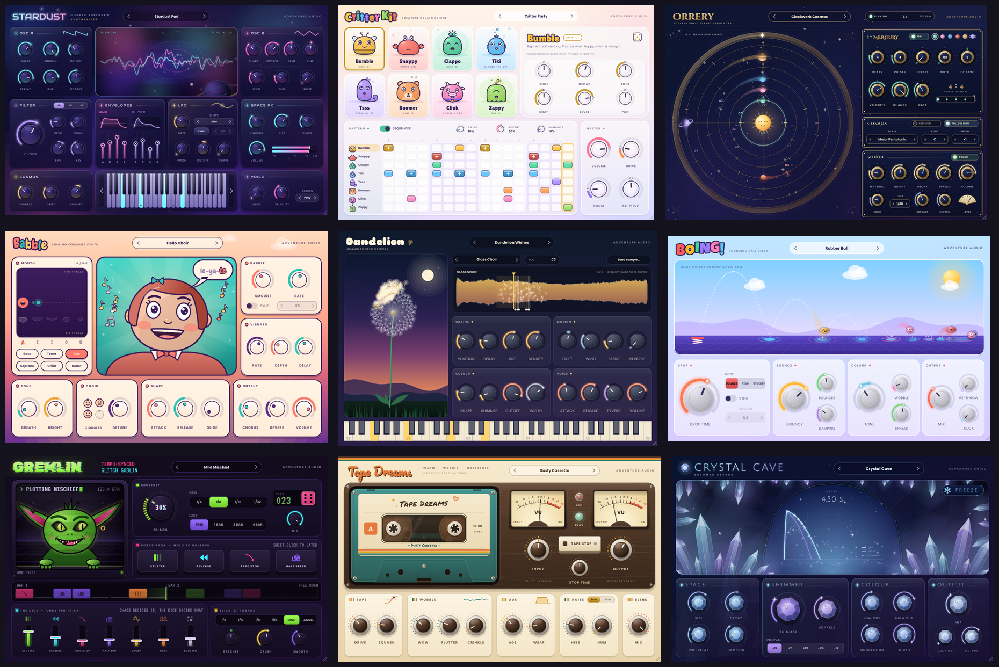
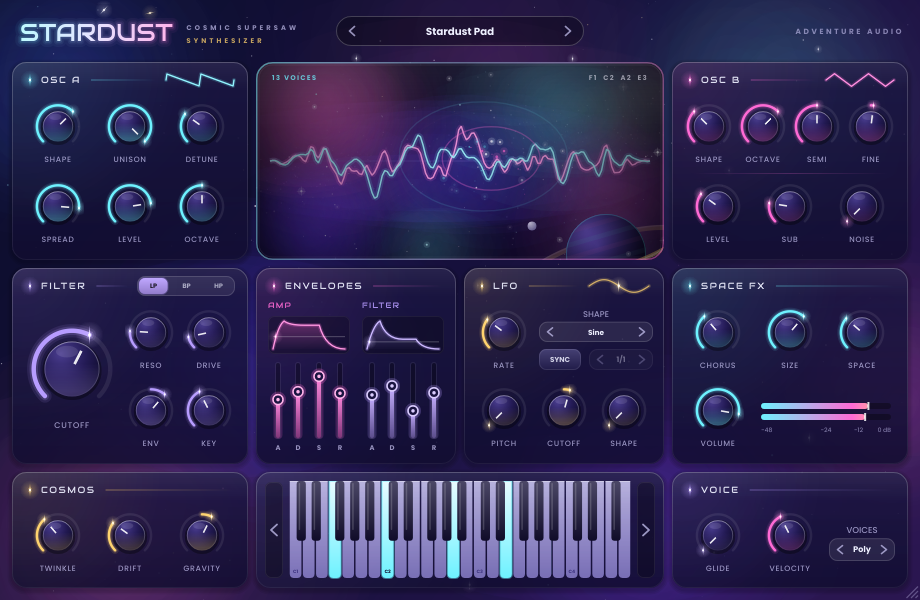
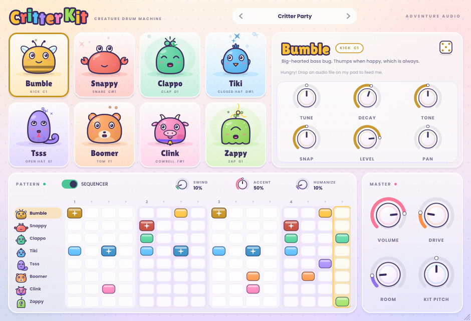
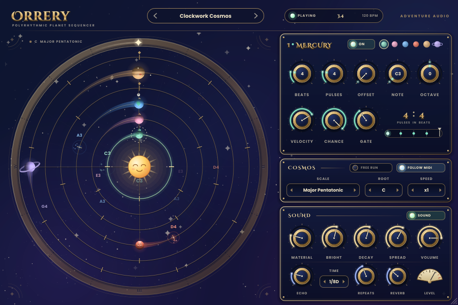
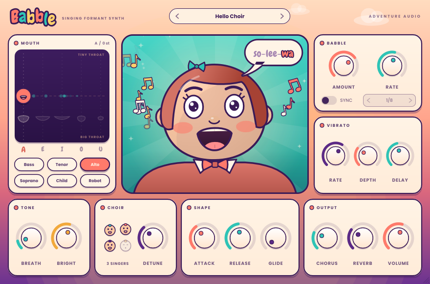
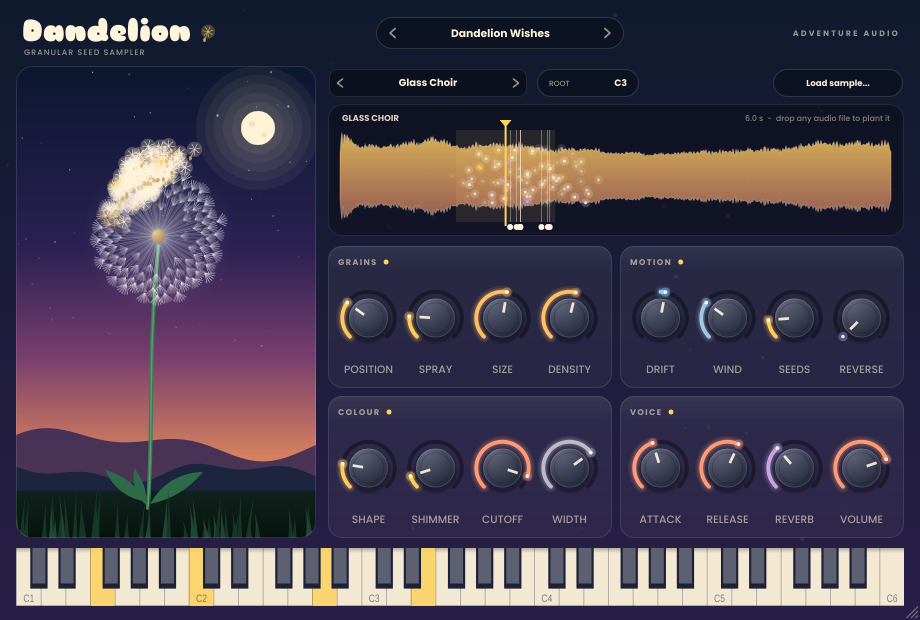
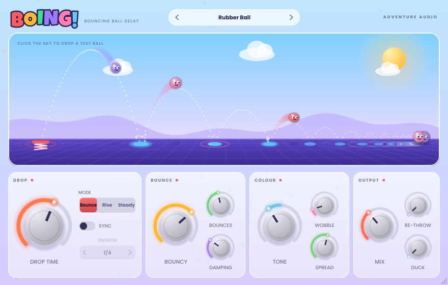
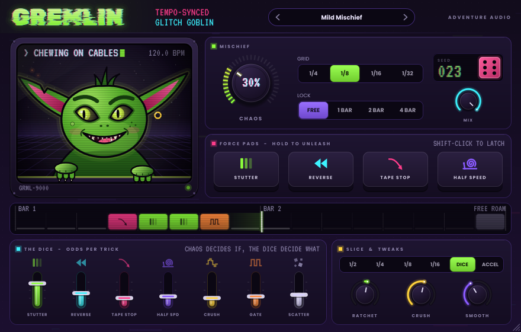
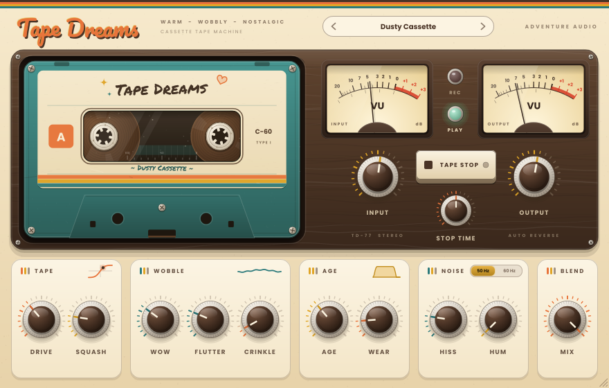
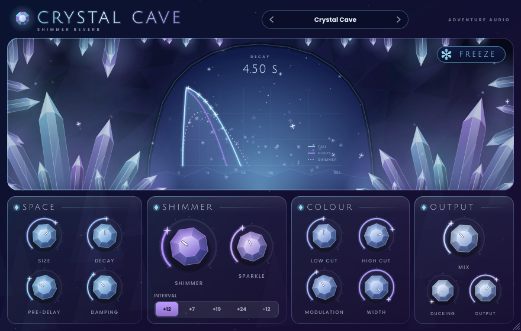

# 🎒 The Adventure Pack

**Nine whimsical, good-looking, genuinely useful plugins for Ableton Live**: five instruments and four effects,
each with its own hand-drawn personality. VST3 for macOS + Windows, Audio Units for macOS.



🎬 **[Watch the 1-minute tour](docs/media/adventure-pack-showcase.mp4)**: every plugin's real UI and real audio, cut together as one song.
It's also attached to each [release](https://github.com/ericrius1/abletonadventures/releases/latest).

## ⬇️ Install (2 minutes)

**macOS**: open Terminal, paste this and press Enter:

```bash
curl -fsSL https://github.com/ericrius1/abletonadventures/releases/latest/download/install-macos.sh | bash
```

<sub>Or download **AdventurePack-macOS.zip** from the [latest release](https://github.com/ericrius1/abletonadventures/releases/latest),
unzip it and double-click **Install Adventure Pack.command**.</sub>

**Windows**: download **AdventurePack-Windows.zip** from the [latest release](https://github.com/ericrius1/abletonadventures/releases/latest),
unzip it, double-click **Install Adventure Pack.bat** and allow admin access.

**Then in Live:** *Preferences → Plug-Ins →* switch on **Use VST3 Plug-in System Folders** (and **Use Audio Units** on a Mac)
→ **Rescan**. Everything appears under **Plug-Ins → Adventure Audio**.

> The plugins aren't code-signed by Apple/Microsoft. The installers handle that for you: on macOS they clear the
> download quarantine and apply a local signature so Live loads them; on Windows they unblock the files.

## 🎹 Instruments

| | |
|---|---|
|  | **✨ Stardust**: a cosmic supersaw pad synth. Two morphing oscillators with up-to-7-voice unison, sub + noise, a state-variable filter, LFO, analog *Drift*, and *Twinkle*, which sprinkles sparkling harmonic glints (you can watch them twinkle as stars). Lush chorus and a huge space reverb built in. |
|  | **🐸 Critter Kit**: eight synthesized drum critters (kick, snare, clap, hats, tom, clink, zap) on C1–G1, the bottom of a Drum Rack / Push grid. A 16-step sequencer locked to Live's transport, swing, drive and room. **Drag any audio file onto a critter and it eats it**: that pad becomes a sampler. |
|  | **🪐 Orrery**: a polyrhythmic planet sequencer. Six planets orbit a sun, each with its own beats/pulses (3 against 4, 5 against 7...), notes in a scale, and probability. It plays a celestial bell voice *and* outputs MIDI to drive your other instruments. Hold a chord and the planets sing your chord. It follows Live's transport (turn on *Free Run* to keep it spinning while stopped). |
|  | **🗣️ Babble**: a singing formant synth with a cartoon face. Morph between vowels A-E-I-O-U across bass/tenor/alto/soprano/child/robot voices, add vibrato, breath and a choir, then turn up *Babble* and it sings gibberish. The face mouths every vowel. |
|  | **🌼 Dandelion**: a granular seed sampler. Drop any sound on it, or use the four built-in sources, and play it as drifting clouds of grains: position, spray, size, density, drift, wind gusts, octave "seeds", reverse grains. Every grain floats off the dandelion as a seed. |

## 🎛️ Effects

| | |
|---|---|
|  | **🏀 Boing**: a bouncing-ball delay. Echoes land like a ball bouncing to rest, each sooner and softer than the last (or rising, or steady). Tempo sync, per-bounce tone, ping-pong spread, springy wobble, *Re-throw* feedback and ducking. Click the sky to drop a test ball. |
|  | **👹 Gremlin**: a mischievous tempo-synced glitch machine. Every step it rolls the dice: stutter, reverse, tape-stop, half-speed, bitcrush or gate, with per-effect odds, a *Chaos* master, a repeatable *Lock* and automatable *Force* buttons. The gremlin's face shows what it's up to. |
|  | **📼 Tape Dreams**: a warm, wobbly cassette machine. Saturation, wow and flutter, age (bandwidth), wear (dropouts), crinkle, hiss and hum, plus a *Tape Stop* you can automate. The reels spin and wobble along. |
|  | **💎 Crystal Cave**: a shimmering crystalline reverb. A dense modulated FDN with octave/fifth shimmer in the feedback loop, *Sparkle*, *Freeze* for infinite pads, ducking and width. The crystals glow with the tail. |

## 💡 Tips for Live

* **Resizable**: drag the bottom-right corner of any plugin window; the UI scales crisply.
* **Presets**: click the preset name at the top (arrows step through). *Save preset…* stores your own in
  `Documents/Adventure Audio`. Live's own device presets work too.
* **Push**: the most playable parameters come first, so Push's first bank is useful out of the box.
* **Orrery → other instruments**: put Orrery on a MIDI track, then on another MIDI track set *MIDI From* to the
  Orrery track, choose *Orrery* in the second dropdown, and arm/monitor it.
* **Critter Kit + Drum Rack habits**: notes C1–G1 (36–43) trigger the eight critters; the sequencer runs while
  Live is playing (toggle *Seq* off to play it purely from MIDI clips).

## 🛠️ Building from source

C++17 + [JUCE 9](https://juce.com) + CMake. See [docs/DEVELOPING.md](docs/DEVELOPING.md) for the layout, the shared
**AdventureKit** library, and the Linux test harness that renders audio and screenshots every plugin.

```bash
cmake -S . -B build -DCMAKE_BUILD_TYPE=Release
cmake --build build --config Release
scripts/package.sh macOS build     # or Windows / Linux -> dist/AdventurePack-<platform>.zip
```

Every push builds all platforms on GitHub Actions, validates each plugin with
[pluginval](https://github.com/Tracktion/pluginval) (and `auval` for the Audio Units), and publishes the zips to the
[latest release](https://github.com/ericrius1/abletonadventures/releases/latest).

## 📜 License

The Adventure Pack is free software under the [GNU AGPLv3](LICENSE), because it's built on the open-source edition of
JUCE (AGPLv3). If you ever want to sell closed-source versions of these plugins you'd need a commercial JUCE licence.
Fonts are from Google Fonts under the SIL Open Font License / Apache 2.0.
